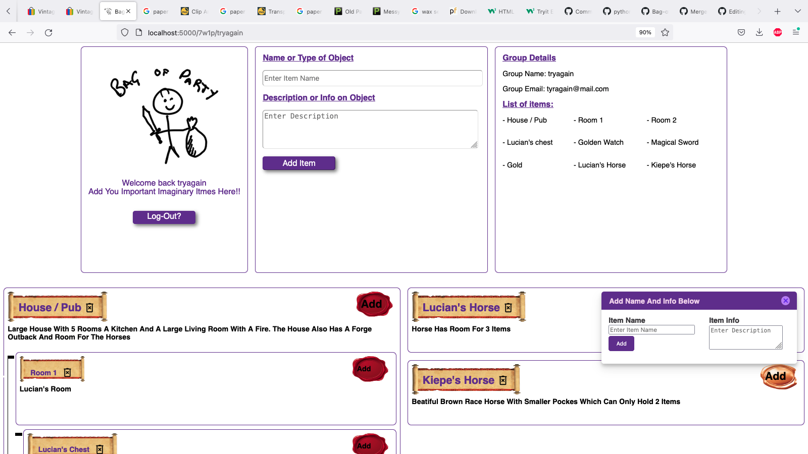
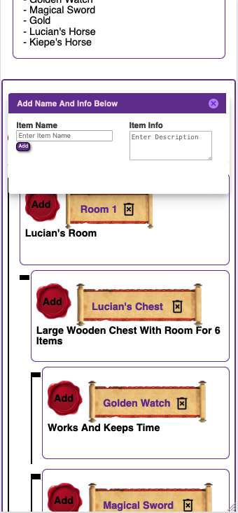
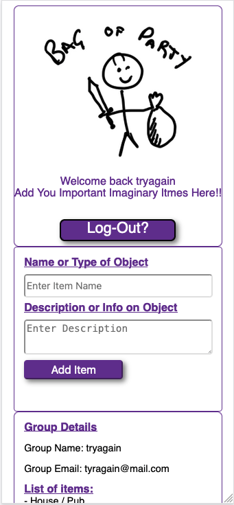

# python-website

Bag of party repo for Python build
This project is designed to build a simple UI for storing loot in a range of multi player board games or computer games.

We have used a relativly simple tech stack to initialy build the MVP which can then be built appon.

## Tech stack

Python: Front and back
Flask: For managing MVC
html - css - jquery: For rendering window

## Set up below

setup and notes below. How to run on a local server once cloned

1. Create a local enviorment.

- $ python3 -m venv nameofenviroment

2. Start local enviorment so you can start the server on request.

- $ . nameofenviroment/bin/activate

3. Fire up local host server.

- $ python nameofprogram.py

4. Go to browser and localhost:5000

## Run Enviroment

Once you have set up the enviorment you neet to activate it to enable communications
$ . venv/bin/activate

Then to open the browser interface run
$ python app/main.py

After this you can open a broswer and go to http://localhost:5000/

## Dont forget:

- open up docker on desktop

- open Tabel plus and run SQL lines for current DB

## Heroku deployment

- Sign into Heroku - $ heroku login
- Then run - $ git push heroku main

### docker setup

docker run -p 2345:5432 -e POSTGRES_PASSWORD=mysecretpassword -d postgres

docker kill potgres

psql -h 127.0.0.1 -U postgres -p 2345

create table parties (
id text not null,
party_name text not null,
user_email text,
party_password text
)

## Gottchas

- error psycopg2.errors.UndefinedTable: relation "parties" does not exist
  = relations means table so this means not parties table exsists. venv/bin/activate
  
## Wireframe
#### Current 

#### Mobile

<!--   -->
